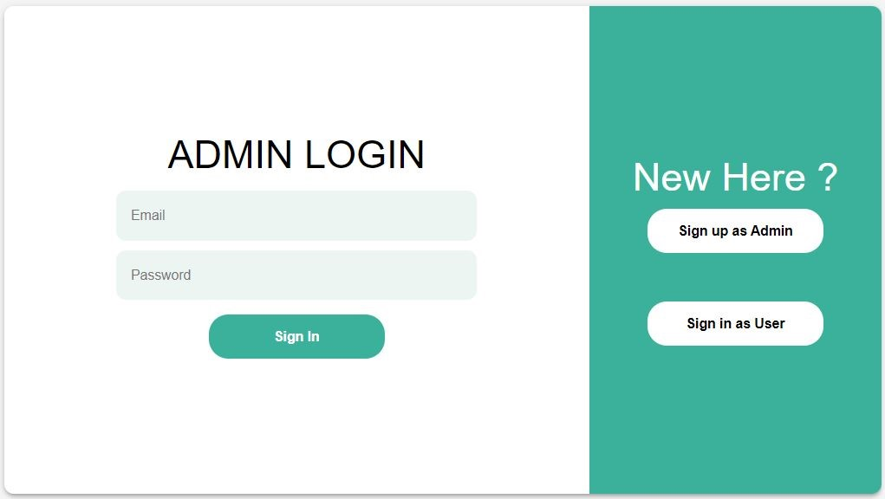
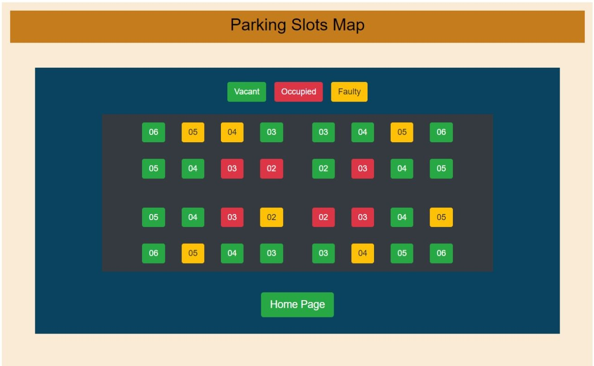
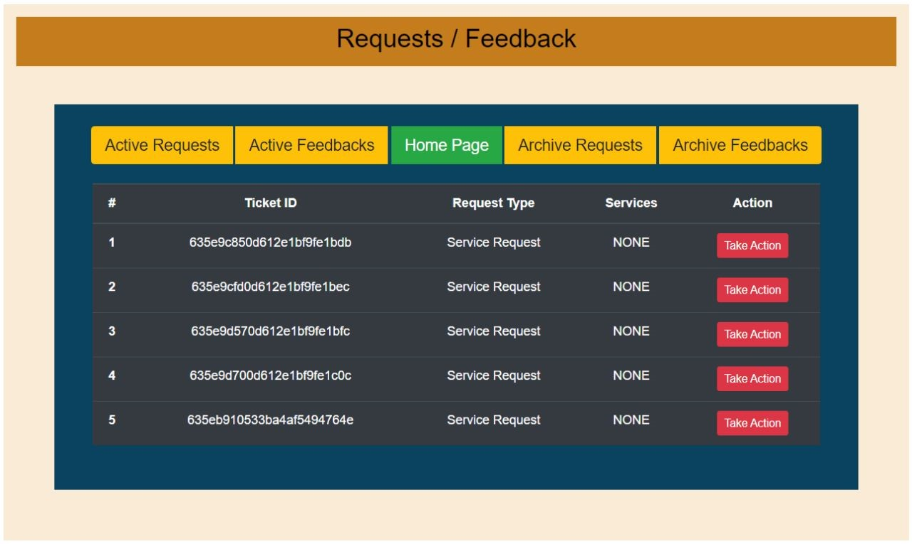
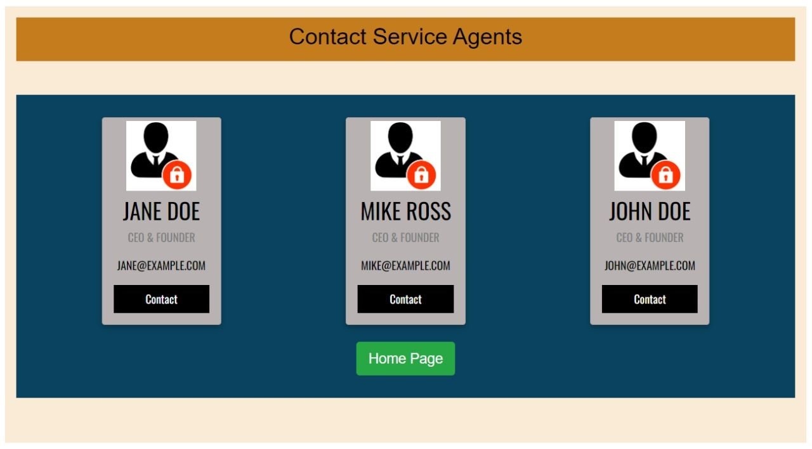
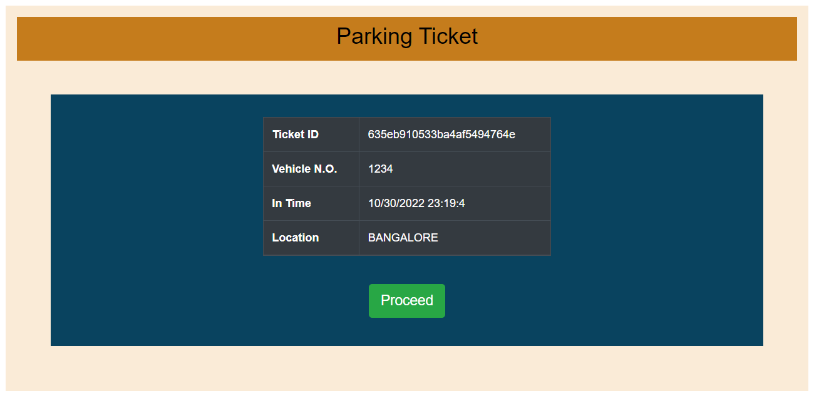
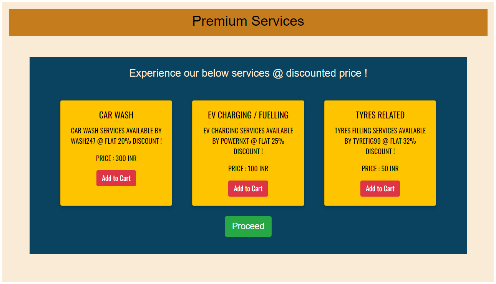
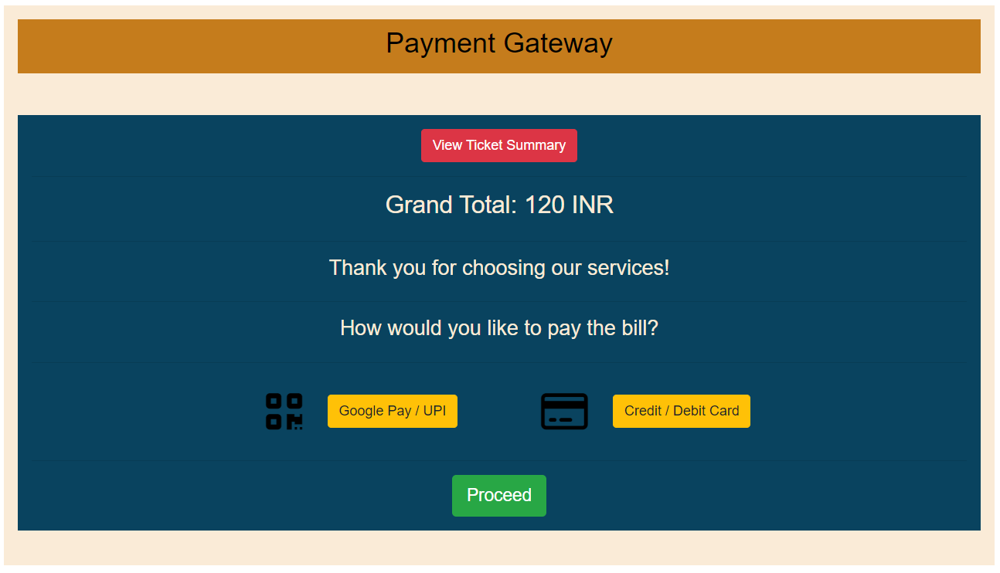

# Park-N-Ride-webapp

This is a web application for a Park N Ride system. From booking a slot to making payment to raising issues to admin, our web app will be the interface for communicating with Park N Ride authorities. Admin would also use this interface to resolve user services and queries and deal with various parking complex related issues. 

## Tech Stack

- Backend: Node.js, Express.js
- Database: MongoDB
- Frontend: React.js

## USER MANUAL

Link - https://github.com/aakash-g-acharya/Park-N-Ride-webapp/blob/main/USER-MANUAL.pdf

## Run Locally

Clone the project

```bash
  git clone https://github.com/aakash-g-acharya/Park-N-Ride-webapp.git
```

Go to the project directory

```bash
  cd Park-N-Ride-webapp
```

Install dependencies for backend-server and start it  

```bash
  cd server
  npm install
  nodemon
```

Install dependencies for client-server and start it (in another terminal)

```bash
  cd client
  npm install
  npm start
```


Import the park-slots json source file present in the repository to your local database.

## Features - for Admin

- Admin signin/signup 
- View profile
- Service parking slots - if faulty 
- Service agent contact information for assistance
- Manage service requests and feedbacks from Users


## Features - for Customers

- User signin/signup 
- View profile
- Book ticket for availing parking service
- Avail additional vehicle maintanence services at a premium cost
- Checkout
- Feedback form


## Admin Interface

### Admin signin


### View Parkingslot Status


### Manage services and feedback


### Service agent contact information for assistance


## Customer Interface


### Book Ticket


### Avail service


### Checkout


## Contact

Aakash G Acharya - aakashgacharya@gmail.com

Aniketh Narayan Bellala - aniketh.bellala@gmail.com

Project Link: (https://github.com/aakash-g-acharya/Park-N-Ride-webapp)


